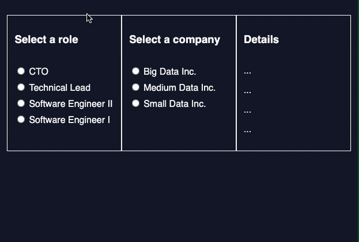

# **WorkAround Explorer**

The WorkAround Explorer makes WorkAround's data more viewable. This training project, prepared by [Codecademy](https://www.codecademy.com/learn/introduction-to-javascript), has been an invaluable exercise in JavaScript modules.

## Table of Contents

- [Project Prompt](#project-prompt)
- [Technologies](#technologies)
- [Setup](#setup)
- [Sources](#sources)

## Project Prompt

WorkAround is a research organization that provides data on salary trends in the tech industry. Open up `salaryData.js` to see the data they have collected. You’ll notice that they have also created a few functions for filtering that data to get subsets of data by role and by company.

WorkAround now wants to release a new web application called WorkAround Explorer to make their data more easily viewable. This web app should allow users to choose specific roles and companies in the tech industry to see the following information:

- The salary for the chosen role at the chosen company.
- The industry average for the chosen role.
- The average salary at the chosen company across all roles.
- The industry average salary across all roles and all companies.

Much of the user interface has already been designed by front-end developers, however, the core data and functionality are either missing or need to be connected together using modules. Your task is to help your team members out by using your `import` and `export` expertise!

## Technologies

- JavaScript (ES6)

## Setup

To view the final output, click [here](https://daniellabrador.github.io/codecademy-js-workaround_explorer/).

## Sources

The techniques utilized was based on the lessons taught in [Codecademy's Learn JavaScript Course](https://www.codecademy.com/learn/introduction-to-javascript). The challenge is also provided by Codecademy.
